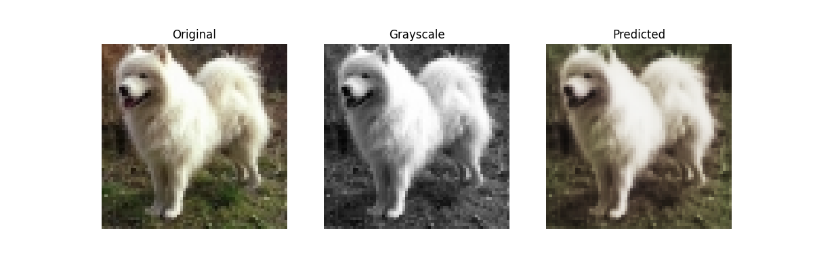

#  GAN-Image-Colorization

## Overview
This project uses a deep learning model to colorize black and white images. It leverages a U-Net architecture and is particularly focused on colorizing images of dogs. The model is trained and tested using the Linnaeus 5 dataset.

## Prerequisites
- Python 3.x
- Pip (Python package manager)

## Installation
Clone this repository and install the required Python packages:
```bash
git clone [Your Repository URL]
cd [Your Repository Name]
pip install -r requirements.txt
```

## Dataset
You need to download the Linnaeus 5 dataset in 64x64 and structure it as follows:
- Organize the images in `test/dog` and `train/dog` directories within the project folder.

You can find the Linnaeus 5 dataset at [Linnaeus 5 Dataset](http://chaladze.com/l5/) or an alternative source. Ensure to adhere to the dataset's terms of use.

## Running the Application
Execute the main script `app.py` to start the training and colorization process:
```bash
python app.py
```
The script processes the images, trains the model. Each epoch generates a colorized image from the test set, shown alongside its original and grayscale versions. The model's output images are saved in an `output` directory.


